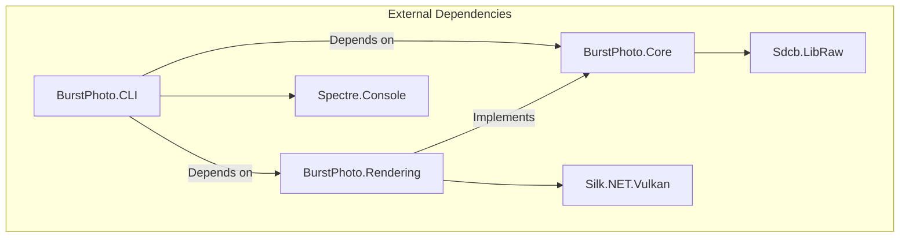
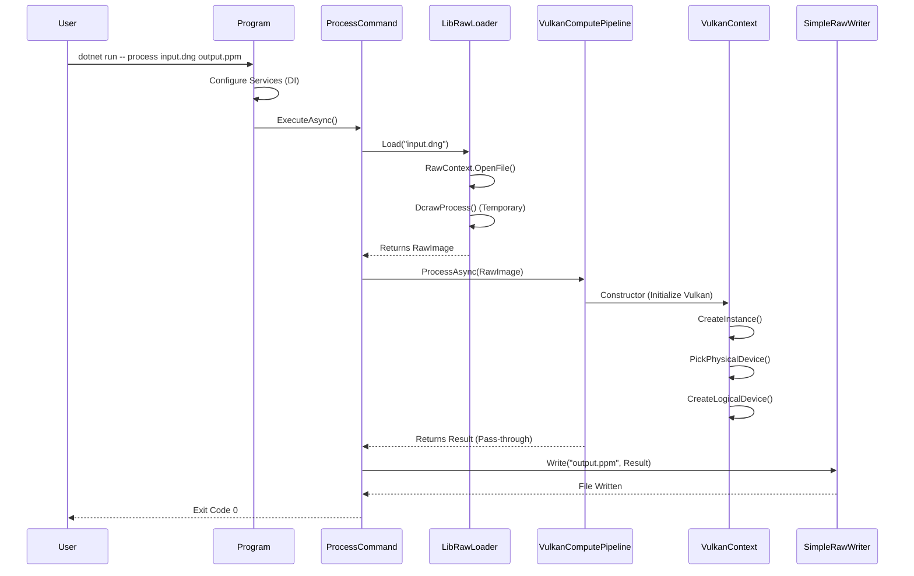

# Architecture Deep Dive

## Overview

BurstPhoto (.NET) follows a modular, layered architecture designed for cross-platform compatibility (Windows, Linux, macOS). The application is split into three main projects to separate concerns: User Interface (CLI), Domain Logic (Core), and Hardware Acceleration (Rendering).

### High-Level Dependency Graph



## Project Breakdown

### 1. BurstPhoto.Core
**Role:** The center of the onion. Defines domain models and interfaces. It has no dependency on the UI or the Graphics backend.

*   **Key Interfaces:**
    *   `IRawImageLoader`: Abstraction for loading RAW images.
    *   `IComputePipeline`: Abstraction for the image processing pipeline.
    *   `IRawImageWriter`: Abstraction for saving results.
*   **Key Models:**
    *   `RawImage`: Represents a raw image in memory. Currently holds 16-bit integer data (`ushort[]`), dimensions, and color/black-level metadata.

#### Deep Dive: LibRaw Integration (`LibRawLoader.cs`)
The project uses `Sdcb.LibRaw` (a C# wrapper around the C++ LibRaw library) to handle the complexity of parsing proprietary RAW formats (CR2, NEF, ARW, etc.).

**Current Implementation State:**
Currently, the loader performs a "demosaic" step using `DcrawProcess()` to produce a 16-bit linear RGB image. This is a temporary vertical-slice implementation to facilitate early pipeline testing. The final goal is to access raw Bayer data directly.

```csharp
// Snippet from LibRawLoader.cs
public unsafe RawImage Load(string path)
{
    using var context = RawContext.OpenFile(path);

    // Temporary: Use internal processing to get 16-bit linear data
    context.Unpack();
    context.OutputBitsPerSample = 16;
    context.Gamma[0] = 1; context.Gamma[1] = 1; // Linear
    context.DcrawProcess();

    // ... Copy data to RawImage model ...
}
```

### 2. BurstPhoto.Rendering
**Role:** Handles all GPU interactions. It implements the interfaces defined in `Core`.

*   **Technology:** Vulkan via `Silk.NET`.
*   **Key Components:**
    *   `VulkanContext`: Manages the lifetime of the Vulkan Instance, Physical Device selection, and Logical Device creation.
    *   `VulkanComputePipeline`: The concrete implementation of `IComputePipeline`.

#### Deep Dive: Vulkan Context (`VulkanContext.cs`)
This class encapsulates the boilerplate required to initialize Vulkan.

1.  **Instance Creation:** Initializes the Vulkan API.
2.  **Physical Device Selection:** Iterates available GPUs and prioritizes a **Discrete GPU**.
3.  **Queue Family Selection:** Finds a queue family that supports `QueueFlags.ComputeBit`.
4.  **Logical Device Creation:** Creates the device and retrieves the Compute Queue.

```csharp
// Snippet from VulkanContext.cs showing device selection
private void PickPhysicalDevice()
{
    // ... Enumerate devices ...
    // Pick first discrete, or first available
    PhysicalDevice = devices[0];
    for (int i = 0; i < deviceCount; i++)
    {
        Vk.GetPhysicalDeviceProperties(devices[i], out var props);
        if (props.DeviceType == PhysicalDeviceType.DiscreteGpu)
        {
            PhysicalDevice = devices[i];
            break;
        }
    }
}
```

#### Deep Dive: Compute Pipeline (`VulkanComputePipeline.cs`)
**Current Implementation State:**
This class is currently a stub. It initializes the `VulkanContext` (proving that Vulkan can start up on the host machine) but simply passes the input image through to the output without modification. This serves as a "Passthrough" to verify the CLI plumbing.

**Note on Shader Compilation:**
`Silk.NET.Shaderc` is included as a dependency for runtime HLSL compilation to SPIR-V. While a test shader (`Shaders/Passthrough.hlsl`) exists, the code to compile and dispatch it is not yet implemented in `VulkanComputePipeline`.

### 3. BurstPhoto.CLI
**Role:** The entry point. Handles argument parsing and orchestrates the application using `Spectre.Console.Cli`.

*   **Pattern:** Command Pattern. Each CLI verb (e.g., `process`) corresponds to a class (e.g., `ProcessCommand`).
*   **Dependency Injection:** Uses `Microsoft.Extensions.DependencyInjection` to wire up `Core` interfaces to `Rendering` and `LibRaw` implementations.

#### Sequence Diagram: The `process` Command



## External Libraries Rationale

| Library | Purpose | Rationale |
| :--- | :--- | :--- |
| **Silk.NET** | Vulkan Bindings | A fast, thin, and up-to-date wrapper for Vulkan (and other APIs). Unlike higher-level engines, it gives us raw access to the API, which is necessary for porting custom compute shaders. |
| **Sdcb.LibRaw** | RAW Image I/O | C# binding for the industry-standard LibRaw C++ library. Essential for decoding the vast array of proprietary camera RAW formats. |
| **Spectre.Console** | CLI Framework | Provides robust argument parsing, help generation, and rich text output (progress bars, tables) to create a professional CLI experience. |
| **Silk.NET.Shaderc** | Shader Compilation | (Added to project) Allows runtime compilation of HLSL shaders to SPIR-V, enabling us to write shaders in a familiar language (HLSL) while targeting Vulkan. |
