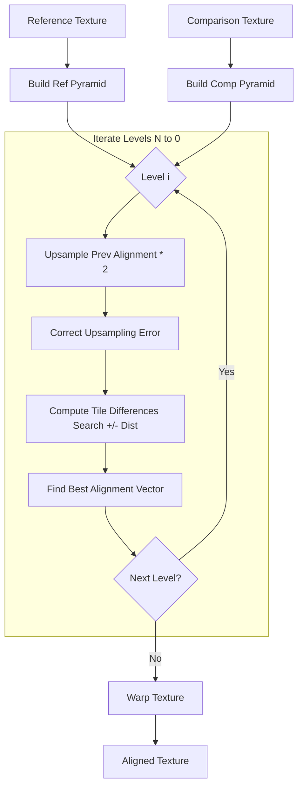

# Hierarchical Image Alignment

## Overview

The alignment module (`burstphoto/align/align.swift`) implements a hierarchical, pyramid-based alignment algorithm. This approach allows the system to handle large displacements between frames by first aligning downscaled versions of the images (coarse alignment) and then refining the alignment at higher resolutions (fine alignment).

## Algorithm Pipeline

The core function is `align_texture`. It takes a reference image pyramid and a comparison image, and outputs a warped version of the comparison image that aligns with the reference.

### 1. Pyramid Construction (`build_pyramid`)
Both the reference and comparison images are downscaled iteratively to create a Gaussian pyramid.
*   **Level 0**: Original resolution.
*   **Level N**: Lowest resolution (coarsest).

Each level is generated using `avg_pool`, which averages pixel values to downsample the image.

### 2. Coarse-to-Fine Alignment
The alignment process starts at the lowest resolution level (top of the pyramid) and proceeds down to the original resolution.

For each level `i` (from `N` down to `0`):
1.  **Upsample Alignment**: The alignment vectors from the previous (coarser) level `i+1` are upsampled by a factor of 2.
2.  **Correct Upsampling**: `correct_upsampling_error` checks 3 candidate vectors (current, +1, -1) to refine the upsampled guess.
3.  **Compute Differences**: `compute_tile_diff` calculates the difference/cost for a search window (e.g., +/- 2 pixels) around the current alignment estimate.
    *   Uses L2 norm (SSD) for coarse levels.
    *   Uses L1 norm (SAD) for the finest level.
4.  **Find Best Alignment**: `find_best_tile_alignment` selects the offset that minimizes the difference cost.

### 3. Warping
Once the final alignment vectors (at Level 0) are computed, `warp_texture` is called to deform the comparison image to match the reference.

## Logic Flow Diagram

## Key Functions

### `compute_tile_diff`
Calculates the cost function for alignment candidates. It computes the difference between the reference tile and the comparison tile shifted by various offsets.
*   **Inputs**: Reference layer, Comparison layer, Previous alignment.
*   **Output**: A 3D texture containing cost values for each tile and each search position.

### `warp_texture`
Applies the computed flow field (alignment vectors) to the comparison image.
*   Handles different Bayer patterns via `warp_texture_bayer` or `warp_texture_xtrans` shaders.
*   Ensures that color channels are respected during the warp (e.g., Green pixels map to Green pixels).

## Metal Shaders involved
*   `avg_pool`: Downsampling.
*   `compute_tile_differences`: Core cost computation.
*   `find_best_tile_alignment`: Argmin operation on the cost volume.
*   `warp_texture_bayer`: Final image deformation.
