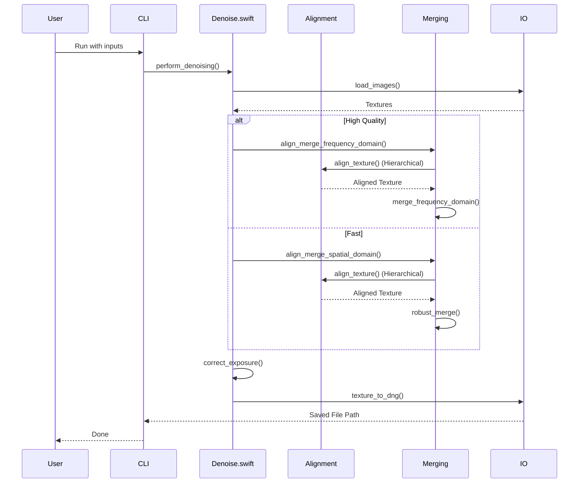

# Burst Photo Architecture Overview

## Introduction

Burst Photo is an image processing application designed to enhance image quality by stacking (merging) multiple frames from a burst. It primarily focuses on noise reduction and dynamic range enhancement using advanced alignment and merging algorithms. The original implementation relies on Swift for orchestration and Metal for GPU-accelerated compute operations.

## High-Level Architecture

The application is structured into a command-line interface (CLI) and a core processing library. The core logic is orchestrated by `denoise.swift`, which manages the image processing pipeline.

```mermaid
graph TD
    CLI[CLI (cli.swift)] --> Orchestrator[Orchestrator (denoise.swift)]
    GUI[GUI (App.swift)] --> Orchestrator

    Orchestrator --> IO[IO & Preparation]
    Orchestrator --> Align[Alignment]
    Orchestrator --> Merge[Merging]
    Orchestrator --> Post[Post-Processing]

    IO --> IO_DNG[io_dng (LibRaw/DNG SDK)]
    Align --> AlignMetal[align.metal]
    Merge --> Spatial[Spatial Merge (Fast)]
    Merge --> Frequency[Frequency Merge (HQ)]
    Post --> Exposure[Exposure Correction]
```

## Processing Pipeline

The core processing pipeline in `denoise.swift` (`perform_denoising`) follows these sequential steps:

1.  **Input Validation**: Checks for image consistency (extensions, count).
2.  **DNG Conversion**: Converts generic RAW files to DNG using Adobe DNG Converter if necessary.
3.  **Loading**: Loads DNGs into Metal textures (`load_images`).
4.  **Reference Selection**: Selects the reference frame (usually the middle frame or the one with the lowest exposure).
5.  **Alignment & Merging**:
    *   **Temporal Averaging**: Simple averaging for static scenes or specific noise reduction settings.
    *   **Spatial Domain (Fast)**: Optimized for speed, uses binomial filtering and robust merging.
    *   **Frequency Domain (High Quality)**: Uses FFT/DFT for precise alignment and merging, better handling of complex motion and noise.
6.  **Post-Processing**:
    *   **Exposure Correction**: Adjusts exposure based on reference white/black levels.
    *   **Output Conversion**: Converts floating-point textures to 16-bit integers.
    *   **Saving**: Writes the result back to a DNG file.



## Key Modules

| Module | File | Description |
| :--- | :--- | :--- |
| **CLI** | `cli.swift` | Entry point for command-line usage. Iterates over burst folders and triggers processing. |
| **Orchestrator** | `denoise.swift` | Main entry point (`perform_denoising`). Manages resources, progress reporting, and high-level logic switching. |
| **Alignment** | `align/align.swift` | Implements hierarchical pyramid-based alignment. |
| **Merging** | `merge/spatial.swift`, `merge/frequency.swift` | Contains the core merging algorithms. |
| **Exposure** | `exposure/exposure.swift` | Handles exposure compensation and tone mapping logic. |
| **IO** | `io_dng/` | Wrapper around DNG SDK and LibRaw for reading/writing RAW files. |
